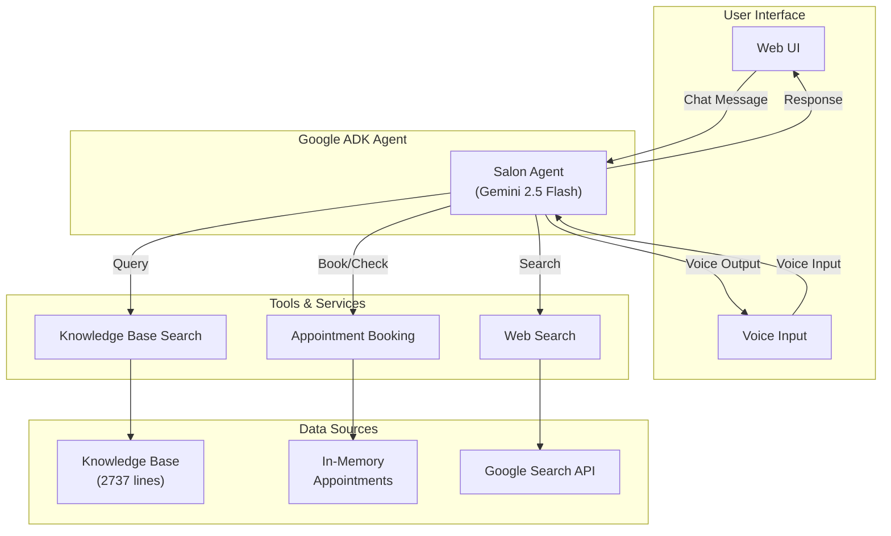
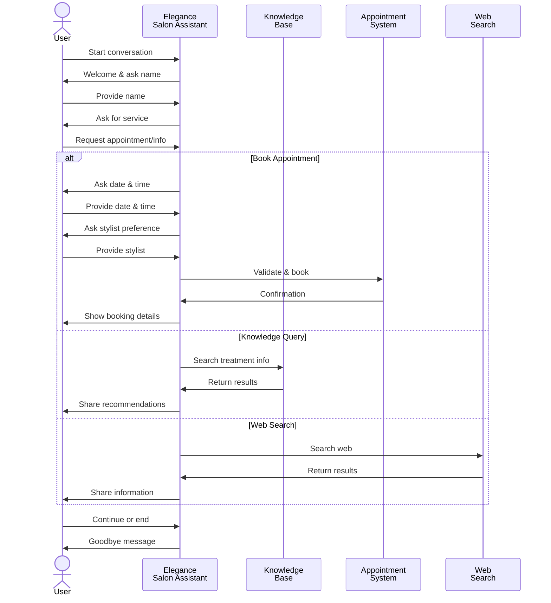

# Elegance Hair Salon & Spa - AI Voice Bot

A sophisticated AI voice assistant built with **Google ADK (Agent Development Kit)** and **Gemini 2.5 Flash** for managing hair salon appointments, providing treatment recommendations, and answering customer inquiries.

## 🎯 Overview

**Elegance Salon Assistant** is a multi-turn conversational AI agent that:
- Greets customers and collects appointment information
- Manages salon appointments with stylist preferences
- Provides hair treatment and care recommendations using knowledge base
- Searches the web for additional information when needed
- Handles voice and text interactions seamlessly

## 🏗️ Architecture Diagram



## ✨ Features

### 🗣️ Voice & Text Interaction
- Natural language understanding for voice and text input
- Human-like responses with context awareness
- Multi-turn conversation support

### 📅 Appointment Management
- Real-time availability checking for stylists (Shruti, Rohan, Aasha)
- Available time slots: 9:00 AM - 5:30 PM (14 slots, excluding 12:00-2:00 PM lunch)
- Case-insensitive stylist name matching
- Double-booking prevention
- Appointment confirmation and summary

### 🧴 Knowledge Base
- Comprehensive hair treatment information
- Hair type classification (Type 1-4)
- Common conditions (dry, oily, frizzy, damaged)
- Treatment details, pricing, and aftercare instructions
- Context-aware search and recommendations

### 🔍 Web Search Integration
- Fallback web search when knowledge base lacks information
- Seamless integration for salon-related queries

## 🚀 Quick Start

### Prerequisites
- Python 3.8+
- Google ADK CLI
- Gemini API credentials (set in `.env`)

### Installation

```bash
# Navigate to app directory
cd /workspaces/Gemini-ADK/app

# Install dependencies (if needed)
pip install -r requirements.txt

# Set up environment variables
# Create/update .env file with your Google API credentials
export GOOGLE_API_KEY=your_api_key_here
```

### Running the Server

```bash
# Start the ADK web server
cd /workspaces/Gemini-ADK/app
adk web
```

Server will start on: **http://127.0.0.1:8000**

Access the web UI to interact with the salon assistant.

## 📁 Project Structure

```
/workspaces/Gemini-ADK/
├── README.md                    # This file
├── adk-streaming/              # ADK streaming examples
├── app/
│   ├── main.py                 # Entry point
│   ├── requirements.txt         # Python dependencies
│   ├── .env                     # Environment variables (API keys)
│   ├── knowledge/
│   │   └── hair_salon_treatment_knowledge_base.txt  # Salon knowledge (2737 lines)
│   └── salon_agent/            # Main agent package
│       ├── __init__.py         # Package initialization
│       ├── agent.py            # Main agent configuration (179 lines)
│       ├── tools_kb.py         # Knowledge base search tool (62 lines)
│       ├── tools_booking.py    # Appointment booking tool (125+ lines)
│       ├── tools_search.py     # Web search tool (43 lines)
│       ├── TOOLS_README.md     # Detailed tool documentation
│       └── .adk/               # ADK artifacts
```

## 🛠️ Tools Documentation

### 1. **Knowledge Base Search** (`tools_kb.py`)
Searches the hair salon knowledge base for treatment information.

**Function:** `search_knowledge_base(query: str, tool_context: ToolContext) -> str`

**Features:**
- Keyword-based relevance ranking
- Returns top 3 matching sections
- Covers treatments, hair types, conditions, pricing

**Example Usage:**
```python
result = search_knowledge_base("Brazilian keratin treatment", tool_context)
# Returns: Treatment details, duration, pricing, and aftercare
```

---

### 2. **Appointment Booking** (`tools_booking.py`)
Manages salon appointments and availability.

**Functions:**
- `book_appointment(customer_name, appointment_date, appointment_time, stylist_name=None, tool_context=None)` 
- `check_availability(appointment_date, stylist_name=None, tool_context=None)`

**Available Stylists:** Shruti, Rohan, Aasha (case-insensitive matching)

**Available Time Slots:** 9:00 AM, 9:30 AM, 10:00 AM, 10:30 AM, 11:00 AM, 11:30 AM, 2:00 PM, 2:30 PM, 3:00 PM, 3:30 PM, 4:00 PM, 4:30 PM, 5:00 PM, 5:30 PM

**Validation:**
- Date format: YYYY-MM-DD
- No past dates allowed
- Case-insensitive stylist name matching
- Prevents double-booking for same date/time/stylist

**Example Usage:**
```python
booking = book_appointment(
    customer_name="Shruti",
    appointment_date="2026-01-25",
    appointment_time="10:00 AM",
    stylist_name="Rohan",
    tool_context=context
)
# Returns: Booking confirmation with details
```

---

### 3. **Web Search** (`tools_search.py`)
Searches the web for additional information.

**Function:** `search_web(query: str, tool_context: ToolContext = None) -> str`

**Features:**
- Wraps Google's web search API
- Tracks search history in context state
- Graceful error handling

---

### 4. **Agent Configuration** (`agent.py`)

**Key Settings:**
```python
root_agent = Agent(
    name="salon_agent",
    display_name="Elegance Salon Assistant",
    model="gemini-2.5-flash-native-audio-preview-12-2025",
    tools=[search_knowledge_base, book_appointment, check_availability, search_web]
)
```

**Conversation Flow:**
1. **Welcome Message:** Bot introduces itself and salon
2. **Name Collection:** Asks for customer name
3. **Service Discovery:** Asks what service customer wants
4. **Appointment Booking:**
   - Step 1: Collects date, time, and stylist preference
   - Step 2: Validates and books appointment
   - Step 3: Confirms and summarizes booking
5. **Knowledge Base Query:** Provides treatment information
6. **Web Search Fallback:** Uses web search if KB has no answer
7. **Conversation End:** Professional goodbye

## 🔧 Configuration

### Model Selection
Current: `gemini-2.5-flash-native-audio-preview-12-2025` (voice-enabled)

Alternative: `gemini-2.5-flash` (text-only, more stable)

To change model, edit [app/salon_agent/agent.py](app/salon_agent/agent.py) and modify the model parameter.

### Environment Variables
Create `.env` file in `/app/` directory:
```
GOOGLE_API_KEY=your_api_key_here
GOOGLE_PROJECT_ID=your_project_id_here
```

## 📊 Sample Conversation Flow

```
Bot: "Hmmm, welcome to Elegance Hair Salon & Spa. I'm Elegance Salon Assistant, 
      your personal beauty advisor. Here we provide hair care and spa-related 
      treatments. May I know your name, please?"

User: "Hi, I'm Sarah"

Bot: "Nice to meet you, Sarah! How can I assist you today? Would you like to 
      book an appointment or learn about our treatments?"

User: "I want to book an appointment for hair treatment"

Bot: "Great! What date would you prefer? (Please provide in YYYY-MM-DD format)"

User: "2026-01-25"

Bot: "Perfect! What time works best for you? Here are available slots..."

User: "10:00 AM"

Bot: "And which stylist would you prefer? We have Shruti, Rohan, and Aasha."

User: "Can I have shruti?"

Bot: "Wonderful! Let me book your appointment with Shruti. 
      [Booking confirmation details...]"
```

## 🔄 Conversation Flow Diagram



## ⚙️ API Endpoints

### Web UI
- **URL:** `http://127.0.0.1:8000`
- **Method:** Interactive chat interface
- **Features:** Voice input/output (if supported), text chat

### Direct API Calls
```bash
# Example: Send message to agent
curl -X POST http://127.0.0.1:8000/api/chat \
  -H "Content-Type: application/json" \
  -d '{"message": "Book an appointment"}'
```

## 🐛 Known Issues

### 1. Voice Model Policy Violation (1008 Error)
**Issue:** `gemini-2.5-flash-native-audio-preview-12-2025` may trigger policy violations on live voice connections.

**Workaround:** 
- Use text-based interactions through web UI
- Switch to `gemini-2.5-flash` model (text-only)
- Contact Google ADK support for voice configuration

### 2. Cache-Related Import Errors
**Issue:** Updated code not being recognized after changes.

**Solution:**
```bash
rm -rf /workspaces/Gemini-ADK/app/salon_agent/__pycache__
```

## 🚀 Deployment

### Current Status
✅ Code deployed to GitHub (Repository: `Shrutika-211998/Gemini-ADK`)  
✅ Latest commits: 
- `c994319`: Initial agent with modular tools
- `f43d277`: Voice bot naming with introduction

### Deployment Steps
```bash
# 1. Push to GitHub
git add -A
git commit -m "Your commit message"
git push origin main

# 2. Pull on deployment server
git pull origin main

# 3. Start server
cd /workspaces/Gemini-ADK/app
adk web
```

## 📈 Future Enhancements

- [ ] **Persistent Database:** Replace in-memory appointments with PostgreSQL/Firestore
- [ ] **Vector Embeddings:** Enhanced knowledge base search with semantic understanding
- [ ] **SMS/Email Confirmations:** Automated booking confirmations
- [ ] **Payment Integration:** Secure payment processing for deposits
- [ ] **Loyalty Program:** Customer rewards and membership tiers
- [ ] **Real-time Availability:** Integration with salon management system
- [ ] **Multi-language Support:** Spanish, French, Hindi localization
- [ ] **Analytics Dashboard:** Booking trends, popular services, staff performance

## 🔐 Security Considerations

- Store API keys in `.env` (never commit to git)
- Use environment variables for sensitive configuration
- Validate all user inputs (dates, times, names)
- Sanitize knowledge base and web search results
- Implement rate limiting for API endpoints

## 📞 Support

For issues or questions:
1. Check [app/salon_agent/TOOLS_README.md](app/salon_agent/TOOLS_README.md) for tool-specific documentation
2. Review Google ADK documentation: https://ai.google.dev/
3. Check error logs in server terminal

## 📝 License

This project is built using Google ADK. Refer to Google's terms of service for licensing information.

## 👨‍💻 Development

- **Framework:** Google ADK (Agent Development Kit)
- **Model:** Gemini 2.5 Flash
- **Status:** Production-Ready ✅

---

**Last Updated:** January 19, 2026